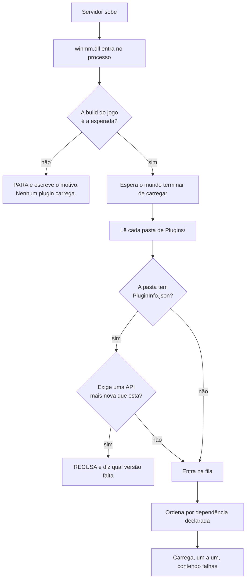
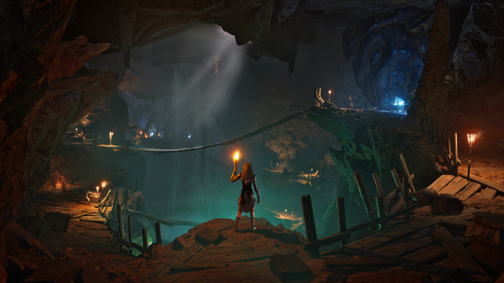

# Conan-Api — plugins no seu servidor de Conan Exiles

O servidor dedicado do Conan Exiles não tem sistema de plugins. Não existe uma
pasta onde você joga um arquivo e ganha um recurso novo. Se você quer um `/kit`,
um sistema de VIP ou um teleporte, a resposta do jogo é que isso não existe.

Esta API resolve isso. Você copia duas coisas para a pasta do servidor, e a
partir daí instalar um plugin é **arrastar uma pasta**.

```
Conan-Api/
   Plugins/
      Permission/            <- já vem, controla VIP e permissões
      PluginQueVoceBaixou/   <- você arrastou esta pasta aqui
```

Só isso. Não tem arquivo de configuração para editar, não tem lista para
preencher, não tem comando para rodar. A pasta estar ali é a instalação.

---

## Antes de tudo: isto roda dentro do seu servidor

Um plugin é uma DLL que roda **dentro do processo do servidor**, com os mesmos
poderes que ele. Isso não é limitação desta API — é o que significa "plugin
nativo" em qualquer jogo. Mas precisa estar dito antes de você instalar
qualquer coisa, e em letra grande:

**Um plugin instalado pode** ler e alterar qualquer coisa na memória do
servidor, ler os dados de identidade dos seus jogadores, escrever qualquer
arquivo que o servidor alcance, abrir conexão de rede, e derrubar o servidor.

**A API contém** falha de plugin ao carregar (o servidor sobe sem ele), exceção
dentro de um hook na maioria dos casos, e conflito entre dois plugins.
**A API não contém** plugin malicioso: não existe sandbox, e não vai existir.

Trate plugin como você trataria qualquer programa que instala no seu servidor:
de quem você confia, de preferência com o código à vista.

---

## Instalar — cinco minutos

Baixe o pacote em [Releases](../../releases). Você vai ter dois itens:

```
winmm.dll      o carregador. Sem ele, nada acontece.
Conan-Api/     a pasta com tudo dentro
```

**1.** Pare o servidor.

**2.** Vá até a pasta do executável:
`<servidor>\ConanSandbox\Binaries\Win64\`

**3.** Renomeie a `winmm.dll` **que já está lá** (a do Windows) para
`winmm_orig.dll`.

> Se já existir um `winmm_orig.dll` ali, **pare**: você já instalou antes.
> Renomear de novo faz o carregador apontar para ele mesmo, e o servidor morre
> em silêncio — sem log, sem erro, só não sobe. Apague a `winmm.dll` nova e
> recomece deste passo.

**4.** Copie a `winmm.dll` (a nossa) e a pasta `Conan-Api` para essa mesma pasta.

**5.** Suba o servidor e abra `Conan-Api\Logs\ConanLoader.log`. Deve estar assim:

```
== ConanLoader iniciado ==
[winmm] encaminhadores prontos: 189 apontam para a winmm_orig, 0 ficaram ausentes.
reflexao estavel: 1508584 objetos vivos (nao cresceu alem de ~2% por 120 s).
1 pasta(s) de plugin encontrada(s).
  [ok] Permission  "Permissões"  v1.0.0  api>=2
       Permissões, grupos e VIP. Outros plugins consultam por ConanPermission.h.
== 1 plugin(s) carregado(s), 0 com falha ==
```

Se esse arquivo não for criado, o carregador não entrou — reveja o passo 3.

---

## Como o carregador escolhe o que subir



**Ele espera o mundo carregar de propósito.** Um plugin que procura jogadores
antes disso encontra um mundo pela metade e conclui coisa errada. Já aconteceu
aqui: um plugin subiu cedo demais e travou o servidor em 4,3 GB em vez dos 8,7
normais.

---

## Instalar, desinstalar, desligar

| você quer | você faz |
|---|---|
| instalar um plugin | arrasta a pasta dele para `Conan-Api/Plugins/` |
| desinstalar | apaga a pasta |
| desligar sem perder a configuração | cria um arquivo vazio chamado `DESLIGADO` dentro da pasta dele |
| descobrir o que aconteceu | abre `Conan-Api/Logs/ConanLoader.log` |

Se uma pasta tiver mais de uma `.dll`, o carregador usa a que tem o nome da
pasta. Se houver duas e nenhuma com o nome certo, ele **recusa e diz qual
renomear** — escolher "a primeira" mudaria conforme o sistema de arquivos
resolvesse listar, e um dia carregaria a errada sem ninguém ver.

---

## O Permission — VIP e permissões

Vem junto e é o plugin que os outros consultam. Ele guarda quem tem o quê num
banco local, dentro da própria pasta:

```
Conan-Api/Plugins/Permission/
   ConanPermission.dll
   config.json          <- os nomes dos grupos, e o banco (veja abaixo)
   permission.db        <- nasce sozinho na primeira execução
```

**Se você não mexer em nada**, ele usa esse banco local e funciona. Se você
quiser um MySQL — porque tem vários servidores e quer o VIP compartilhado entre
eles — é uma linha no `config.json`.

---

## Quando o Conan atualizar

A API vai **se recusar a carregar**, de propósito, e vai dizer isso no log.

Isso não é defeito. Ela conhece o jogo por endereços de memória desta versão
específica; quando a Funcom atualiza, esses endereços mudam de lugar. Uma API que
continuasse trabalhando estaria lendo memória aleatória e entregando números
plausíveis e falsos — seu VIP sumiria, permissões inverteriam, e ninguém ligaria
o problema à atualização do jogo.

Prefira o servidor que não sobe com plugin ao servidor que sobe mentindo. Quando
isso acontecer, espere uma versão atualizada aqui.

---

## Problemas comuns

**"Instalei e nenhum plugin funciona"** — abra `Conan-Api\Logs\ConanLoader.log`.
Se o arquivo não existe, o carregador não entrou: a `winmm.dll` não está ao lado
do executável, ou você esqueceu de renomear a original.

**"O servidor não sobe e não diz nada"** — quase sempre é `winmm_orig.dll`
apontando para si mesma (instalação por cima de outra). Veja o passo 3.

**"Um plugin específico não carrega"** — o log diz o motivo, com o nome da pasta.
Pode ser DLL faltando, `PluginInfo.json` exigindo API mais nova, ou o arquivo
`DESLIGADO` esquecido lá dentro.

---



## Escrever seus próprios plugins

É outro repositório: **[Conan-Api-SDK](../../../Conan-Api-SDK)**. Lá estão o
header, seis exemplos com código-fonte e o guia de compilação. São separados
porque quem administra um servidor não precisa de compilador para nada, e quem
escreve plugin não precisa dos binários do servidor.

---

## Créditos e licença

*Conan Exiles* é da **Funcom**. As imagens deste repositório são material de
divulgação oficial, do Steam. Este projeto não tem vínculo com a Funcom nem com
a Inflexion Games.

Esta API é trabalho independente, feito por engenharia reversa do servidor
dedicado, sem SDK oficial e sem símbolos de depuração.
