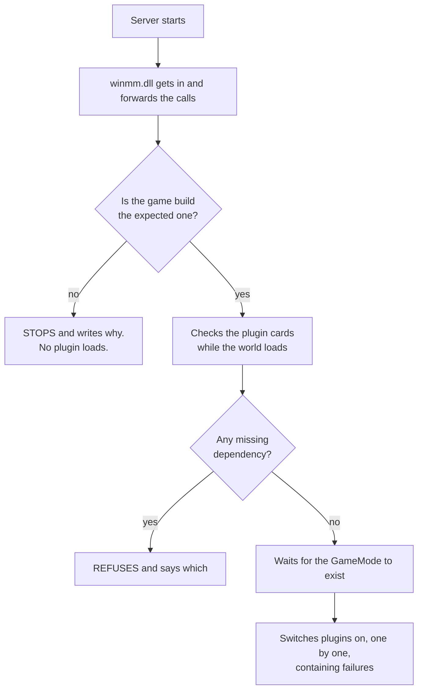

<p align="center">
  
</p>

<p align="center">
  <a href="README.md">&nbsp;<b>English</b></a>
  &nbsp;&nbsp;&middot;&nbsp;&nbsp;
  <a href="doc/README.pt.md">&nbsp;Portugu&ecirc;s</a>
  &nbsp;&nbsp;&middot;&nbsp;&nbsp;
  <a href="doc/README.es.md">&nbsp;Espa&ntilde;ol</a>
</p>


# Conan-Api, native server-side plugin framework for Conan Exiles Enhanced

**Conan-Api is a free, community-developed native server-side plugin framework
for privately operated Conan Exiles Enhanced dedicated servers.** It runs inside the
dedicated server process, on hardware the server administrator controls, and
lets that administrator extend what the *server* does, permissions, VIP tiers,
economy and shops, teleports, administration tooling, scheduled events.

Players connect with an unmodified game client. Nothing is downloaded, nothing
is subscribed to on the Workshop, and no client file is touched.

If you have run an ARK or ASA server, this is the same model as **ArkApi** and
**AsaApi**, for Conan Exiles.

---

## Quick answers

If you're evaluating this project, as a moderator, a community admin, or
someone who saw "DLL" and wanted to check, these are the six questions that
usually come first, answered directly.

**Does this run only on a dedicated server the owner administers?**
Yes. It runs inside `ConanSandboxServer-Win64-Shipping.exe`, on the machine the
server operator controls, from files that operator placed there. There's no
component that runs anywhere else.

**Does it touch the game client?**
No. Nothing is installed, downloaded or patched on any player's machine. Players
connect with an unmodified client and aren't required to subscribe to anything
on the Workshop. There's no client-side code in this project.

**Does it interact with official Funcom servers?**
No. It is loaded by a dedicated server binary that the operator starts on their
own host. It has no functionality directed at servers operated by Funcom, and
nothing here connects to them.

**Does it try to bypass anti-cheat?**
No. There's no anti-cheat interaction, detection-avoidance, obfuscation or
tampering of any kind in this project, and none is documented or supported. The
loader announces itself in its own log file on every start.

**How is the DLL loaded?**
By **DLL proxying** — also called import forwarding or side-loading. The
administrator renames the Windows `winmm.dll` already present in the server's
binary folder to `winmm_orig.dll` and puts ours in its place; ours forwards every
exported call to the renamed original and initialises the plugin runtime
alongside it. It is the same mechanism **ArkApi** and **AsaApi** use. Full
step-by-step, including what happens at startup and shutdown, is in
[How the API enters the server process](#how-the-api-enters-the-server-process).

It does **not** attach to a process it doesn't own, and doesn't use
`CreateRemoteThread` or comparable remote-injection APIs against third-party
processes.

**What privileges does a plugin get?**
Full process privileges, the same as the dedicated server itself. A native
plugin can read and modify server memory, see player identity data, read and
write any file the server user can reach, open network connections, and crash
the process. There's no sandbox between plugins, and there won't be one.

That's a property of native plugins in any game, not a choice this project
made, and it's stated in full under
[Security and trust model](#security-and-trust-model) rather than left for
someone to discover. The practical guidance is the same as for any native server
extension: install what you trust, prefer plugins that publish source.

---

## Scope and intended use

This project is built for **people who operate their own dedicated server** and
want to extend it.

**In scope**

- Privately operated Conan Exiles Enhanced dedicated servers
- Server owners and administrators running their own hardware or rented host
- Development of native, server-side plugins: permissions, VIP, economy, shops,
  teleports, administration, scheduled events, integrations with external systems

**Out of scope, this project isn't built for, and not documented for**

- Official Funcom-operated servers
- Modifying, patching or interfering with another player's game client
- Gaining an advantage over other players in multiplayer
- Bypassing or interfering with anti-cheat
- Obtaining credentials, or access to systems the operator doesn't own

This is a statement of the project's **purpose and design intent**. It isn't a
legal opinion, and it isn't a claim about what is technically impossible: a
native plugin runs with full process privileges, which is exactly why the
[Security and trust model](#security-and-trust-model) below is stated plainly
rather than buried.

Everything here assumes you're the operator of the server you're installing
on, and that installing software on it's your decision to make.

---

## How it works

```
Conan Exiles Enhanced dedicated server  (ConanSandboxServer-Win64-Shipping.exe)
        │
        ▼
Conan-Api runtime layer          loads at process start, resolves the build,
        │                        owns hooks and the game-thread scheduler
        ▼
ABI function table  +  C++ SDK   a plain-C table plugins call through;
        │                        header-only C++ wrappers over the same table
        ▼
Native server plugins            ordinary Windows DLLs in Plugins/<Name>/
        │
        ▼
Permission · Conan Shop · yours
```

**Dedicated server process.** Everything happens inside
`ConanSandboxServer-Win64-Shipping.exe`, on the machine the administrator runs.
There's no client-side component.

**Runtime layer.** Loaded at process start. It verifies the game build before
doing anything else, resolves the engine structures it needs from the running
process, installs its `ProcessEvent` hook, and elects the game thread so that
plugin work is scheduled onto it rather than run from arbitrary threads.

**ABI table and SDK.** Plugins never link against our code. They receive a
pointer to a plain-C struct of function pointers — the ABI table — which is why
a plugin built with MSVC and one built with MinGW both work. The C++ SDK is a
header-only convenience layer that routes to the same table.

**Plugins.** Ordinary DLLs, one folder each, each with a `PluginInfo.json`
declaring its name, version and the minimum API version it needs.

---

## How the API enters the server process

This section is deliberately explicit. The mechanism is a normal one for this
class of tool, and stating it precisely is more useful to everyone than a vague
reassurance.

**The mechanism is DLL proxying (also called import forwarding or DLL
side-loading).** It is the same technique **ArkApi** and **AsaApi** use, and the
same one ReShade and similar tooling use.

Concretely:

1. The administrator stops the server.
2. In `<server>\ConanSandbox\Binaries\Win64\`, the administrator renames the
   Windows `winmm.dll` that is already there to `winmm_orig.dll`.
3. The administrator copies our `winmm.dll` and the `Conan-Api\` folder into the
   same directory.
4. On the next start, Windows resolves `winmm.dll` from the executable's own
   directory before the system directory, so the server loads ours.
5. Our DLL **forwards every exported call to the renamed original**, so the game
   loses no functionality. Alongside that, it initialises the Conan-Api runtime.
6. The runtime verifies the game build. If the build isn't one it has been
   validated against, **it refuses to load and says so in the log** — see
   [Build compatibility](#build-compatibility).
7. Once the world is up, the runtime scans `Conan-Api\Plugins\`, reads each
   plugin's `PluginInfo.json`, resolves declared dependencies, and calls each
   plugin's entry point.
8. At shutdown, plugins are unloaded and forwarded calls stop.

**What this is:** in-process loading, inside a process the administrator starts,
on a machine the administrator controls, from files the administrator placed
there deliberately.

**What this isn't:** it doesn't attach to a process it doesn't own, doesn't
use `CreateRemoteThread` or comparable remote-injection APIs against third-party
processes, doesn't touch the game client, and doesn't run on any machine other
than the server host.

**Files involved:** `winmm.dll` (ours), `winmm_orig.dll` (Windows', renamed by
the administrator), and everything under `Conan-Api\`.

Full installation steps, including the failure modes, are in
[Install](#install--five-minutes-once).

---

## Runtime reflection

The API doesn't hardcode field offsets into plugins. It reads the engine's own
reflection data from the running process to find classes, functions, properties
and their types, and calls game functions **by name**.

Measured on build **`24784646`**, with the world loaded:

| | measured |
|---|---|
| Conan classes visible through reflection | **9,247** |
| reflected functions | **38,340** |
| of those, with a complete typed signature | **~89%** |
| class members catalogued | **36,210** |
| of those, replicated | **1,222** |

These are measurements of one specific build, reproducible with the tools in the
[SDK](https://github.com/andrew-mauricio/Conan-Api-SDK). They aren't a guarantee about future builds:
when Funcom ships a new one, the catalogue has to be re-collected, and the
numbers will differ.

The remaining ~11% are emitted as untyped generic templates on purpose. They are
types that carry ownership of engine memory (`TArray<FString>`, `TMap`,
multicast delegates); passing them by value across the ABI would duplicate
pointers and risk a double free. A generic template that won't compile by
accident is preferable to a signature that corrupts memory.

---

## Security and trust model

A native server plugin is a DLL that runs **inside the server process, with the
same privileges as that process**. That isn't a limitation of this API, it's
what "native plugin" means in any game. It is stated here, in full, because an
administrator deciding what to install needs it before anything else.

**An installed plugin can** read and modify anything in the server's memory, see
player identity data, read and write any file the server user can reach, open
network connections, and crash the process.

**The API does contain**: a plugin that fails during load (the server comes up
without it), an error inside a hook in most cases, an error in work the plugin
scheduled for later (that plugin is quarantined and the server carries on), and
ordering conflicts between plugins.

**The API doesn't contain a malicious plugin.** There's no sandbox between
plugins, and there won't be one, plugins share the process, so any plugin
can reach any other plugin's data, including the permissions database. Isolation
of that kind would require running plugins out-of-process, which is a different
architecture.

Practical consequence: **treat a third-party plugin exactly as you would treat
any other native extension you install on a server you own** — install what you
trust, prefer plugins that publish source, and audit before deploying to a
server with players on it.

---

## Build compatibility

The API is validated against a specific game build and **refuses to load on a
build it doesn't recognise**, deliberately, with the reason in the log.

Validated build: **`24784646`** (Conan Exiles Enhanced, UE 5.6.1).

Refusing is the point. The API locates engine structures in a specific version's
memory layout; when Funcom updates, those move. An API that loaded anyway would
read the wrong memory and return values that **look correct and aren't** — VIP
silently disappearing, permissions inverted, with nothing in any log connecting
it to the game update. A server that won't come up with plugins is preferable
to a server that comes up lying.

Adapting the runtime to a new build is a maintained process on our side, and it
isn't something a plugin author or an administrator has to do. Recognising a
build, and refusing an unrecognised one, is what the shipped runtime does; the
tooling that produces a new supported build is maintained separately and isn't
part of the public distribution.

What matters on your side is the behaviour: an unvalidated build doesn't load,
and it says so.

**Plugins that hardcode raw offsets** are the one case that survives an update
and starts reading the wrong place *without any error*. A plugin author can
declare that dependency in their `PluginInfo.json`, and the loader will then
refuse that plugin on an unvalidated build instead of letting it run with wrong
data.

> **Honest limitation:** every version published so far targets the same build
> (`24784646`). The recovery mechanism has been tested against an executable we
> modified on purpose, but **never against a real Funcom update**. When the first
> one lands, this section gets a measured turnaround time instead of this
> sentence.

---

## What is open, and what isn't

This project draws a deliberate line, and it's worth stating plainly so nobody
has to guess.

**Open source, the public plugin interface and reference implementations**

| | licence | where |
|---|---|---|
| the plugin ABI and every public header | MIT | [SDK](https://github.com/andrew-mauricio/Conan-Api-SDK) `include/Conan/` |
| the complete list of functions the API exposes to plugins | MIT | `ConanPluginApi.h` |
| plugin examples, with source | MIT | SDK `Exemplos/` |
| the Permission plugin, with source | MIT | SDK `Exemplos/Permission/` |
| a complete real plugin, with source and tests | MIT | [Conan-Shop](https://github.com/andrew-mauricio/Conan-Shop) |

**Distributed as a binary, the runtime**

The Conan-Api runtime and loader (`winmm.dll` and the packaged runtime) ship
compiled. Their source isn't published, and the licence is proprietary: you may
run them on as many servers as you like, including servers that charge players,
but you may not resell, re-host or redistribute them.

Documented in the open, even though the source isn't: how the loader enters the
process, what it does at startup and shutdown, the build check, the trust model,
and the full list of functions it exposes to plugins, all in this README and in
the public headers. Every release publishes the SHA-256 of its artifacts, so you
can verify that the file you downloaded is the file that was published.

> To be exact about what that does and doesn't give you: the SHA-256 lets you
> confirm the download wasn't tampered with in transit or re-hosted. It does
> **not** let you reproduce the runtime binary from published source, because
> that source isn't published. Where a reproducible build *is* claimed in this
> project, it's claimed for plugins whose source is public — Conan-Shop, for
> instance, where you can compile and compare the hash yourself.

**Private, the engineering that produced the API**

The tooling that discovers engine structures, resolves them without debug
symbols, generates the typed SDK, and adapts the runtime to a new game build is
maintained privately. That's the work that took the longest, and it's what
distinguishes this project.

None of it ships, none of it executes on your machine, and none of it's part of
any release.

---

## Built on this API

**[Conan Shop](https://github.com/andrew-mauricio/Conan-Shop)** is a complete plugin built on Conan-Api,
and doubles as the reference for what the architecture supports in practice:
chat hooks and command routing, player identification, permission checks, timed
rewards on the game thread, SQLite or MySQL storage, atomic point debiting, item
delivery by Template ID, in-game message-box interaction, and the full plugin
lifecycle including hot reload of its own configuration.

**Permission** ships in this package and provides groups, VIP tiers with
expiry, and stable player identity that other plugins consume through a small C
ABI.

---

## What you can have on your server

The API does nothing on its own, it opens the door for other people to write
things. What is possible today, and proven working:

| what a plugin does | how the player uses it |
|---|---|
| **chat commands** | they type `!kit`, `!online`, `!shop` and the plugin answers |
| **on-screen message** | it appears over their screen, never touching chat |
| **broadcast** | one line that reaches everyone connected at the same time |
| **react to events** | someone joined, died, harvested wood, killed an NPC |
| **VIP and permissions** | who can do what, with groups, stored in a database |
| **read and change the world** | a player's position, an item in an inventory, an object's state |

A shop that sells items through chat, a teleport with saved points, custom
welcome messages, a daily kit for VIPs only, an automatic warning before restart
— all of that is written **on top of** this API, by anyone who wants to.

What exists ready today is **Permission**, which ships in the package. The rest
will come from the community, and that is what the
[SDK](https://github.com/andrew-mauricio/Conan-Api-SDK) is for.

---

## Install, five minutes, once

Download the package from [Releases](../../releases). Two items come in it:

```
winmm.dll      the loader. Without it, nothing happens.
Conan-Api/     the folder with everything inside
```

**1.** Stop the server.

**2.** Go to the executable's folder:
`<server>\ConanSandbox\Binaries\Win64\`

**3.** Rename the `winmm.dll` **already there** (Windows' own) to
`winmm_orig.dll`.

> If a `winmm_orig.dll` already exists, **stop**: you have installed before.
> Renaming again makes the loader point at itself, and the server dies silently
> — no log, no error, it just doesn't come up. Delete the new `winmm.dll` and
> start again from this step.

**4.** Copy our `winmm.dll` and the `Conan-Api` folder into that same folder.

**5.** Start the server and open `Conan-Api\Logs\ConanLoader.log`.

If that file doesn't exist, the loader never got in, go back to step 3.

## How loading works, in plain words

When the server starts, three things happen in order, and the order is the
important part:

**1. We get in, but touch nothing.** `winmm.dll` is loaded along with the
server, forwards the system calls and steps aside. The game starts up normally.

**2. We check the plugins while the world loads.** In those first seconds the
API opens every DLL in `Plugins/`, reads each one's card, checks dependencies
and versions. If a plugin is broken, **you find out here** — at startup, not
half an hour later.

**3. We switch the plugins on when the world exists.** And this step waits on
purpose. A plugin that looks for players before the world has loaded finds a
half-built world and concludes the wrong thing. It happened here: a plugin came
up too early and froze the server at 4.3 GB instead of the usual 8.7.

But the wait isn't a timer, it's a **question to the game**. As soon as the
`GameMode` exists (the same condition that makes the server print
`Match State ... InProgress`), the plugins come in. This used to be a fixed
delay, and the measured result here was **12 minutes** between the world being
ready and the first plugin answering. Today it's **five seconds**.



### What you should see in the log

```
== ConanLoader iniciado ==
[winmm] encaminhadores prontos: 189 apontam para a winmm_orig, 0 ficaram ausentes.
[conferencia] 1 plugin(s) na pasta, 0 ja reprovado(s) na conferencia de arquivos.
[fase1] 1 DLL(s) abertas e validadas, 0 reprovada(s).
mundo montado: achei o GameMode vivo ("ConanGameMode") com 92103 objetos.
  [ok] Permission  "Permissões"  v1.0.0  api>=2
== 1 plugin(s) carregado(s), 0 com falha ==
```

Each plugin shows up with its name, version and verdict. An `[x]` instead of
`[ok]` always comes with the reason written next to it.

---

## Installing without taking the server down

To add a **new** plugin you no longer have to stop everything:

```
1. copy the plugin's folder into Conan-Api/Plugins/
2. create an empty file named CARREGAR-NOVOS, next to the Logs/ folder
```

Within three seconds the loader picks it up, runs the same checks as always and
switches the plugin on. The log says what happened:

```
[novos] [ok] SomeonesShop carregado SEM reiniciar o servidor.
```

**Replacing the version of a plugin that is already running still needs a
restart.** That isn't laziness on our part: a loaded plugin has hooks armed
inside the game, and possibly tasks waiting to run. Unloading its code with any
of those alive makes the server jump to an address that no longer exists, and
the problem shows up **later**, far from the cause, somewhere that doesn't
point back at the plugin. We would rather ask for a restart than ship that.

---

## Day to day

### What has to be inside a plugin's folder

Only the `.dll`. The rest is up to whoever wrote it:

```
Conan-Api/Plugins/SomeonesShop/
   SomeonesShop.dll     <- the only required item
   PluginInfo.json      <- if present, the log shows name and version
   config.json          <- if present, it belongs to the plugin: it reads it, not the API
```

If the author did not include a `PluginInfo.json`, the plugin still loads, the
log shows `[sem PluginInfo.json]` and uses the folder name. What you lose is
knowing its version from the log, and the protection that refuses the plugin on
an old API or on a different game build.

**`config.json` belongs to the plugin, not to us.** The API never opens that
file; it only tells the plugin where it lives. If you need to change something in
it, the reference is the documentation of whoever wrote the plugin.

---

| you want to | you do |
|---|---|
| install a plugin | drag its folder into `Conan-Api/Plugins/` |
| install without stopping the server | copy the folder and create the `CARREGAR-NOVOS` file |
| uninstall | delete the folder |
| switch off without losing the config | create an empty file named `DESLIGADO` inside its folder |
| understand what happened | open `Conan-Api/Logs/ConanLoader.log` |

If a folder holds more than one `.dll`, the loader uses the one named after the
folder. If there are two and none with the right name, it **refuses and says
which one to rename** — picking "the first" would change with whatever order the
filesystem felt like listing, and one day it would load the wrong one unnoticed.

---


## Permission — VIP and permissions

It ships in the package, and it's the plugin the others ask when they need to
know who can do what. It keeps everything in a database inside its own folder:

```
Conan-Api/Plugins/Permission/
   ConanPermission.dll
   config.json          <- group names, and where the database lives
   permission.db        <- born on its own at first run
```

**If you change nothing, it works.** The local database is enough for most
servers.

If you run **several servers** and want VIP shared between them, it's one line
in `config.json` pointing at a MySQL. Plugins that query Permission notice no
difference, the question is the same either way.

And if the database goes down, Permission answers "I don't know" instead of
"no permission". Plugin authors decide what to do with that "I don't know";
you, running the server, don't lose anyone's VIP over a network hiccup.

---

### What about the plugins you installed?

Most keep working. A plugin talks to the API through a function table, and that
table doesn't change shape when the game updates, what gets rebuilt is the
API.

The exception is a plugin that baked **game addresses** into its own binary.
Those start reading the wrong place after a patch, and the worst part is that
nothing errors out: they run, just with wrong data.

That's why the author can declare it in their plugin's card. When they do, and
the build changes, **the loader refuses** and writes the reason:

```
[x] SomeonesShop — feito para a build 24383534 do jogo; esta e' a 24784646.
    Ele usa offset cru: carregar aqui faria ele ler memoria errada SEM erro
    nenhum. Peca a versao nova ao autor.
```

If a plugin disappears from your list after an update, look for that line before
anything else: it says exactly what happened and what to ask the author for.

---

## When something doesn't work

**"I installed it and no plugin works"** — open
`Conan-Api\Logs\ConanLoader.log`. If the file doesn't even exist, the loader
never got in: `winmm.dll` isn't next to the executable, or you forgot to rename
the original.

**"The server doesn't come up and says nothing"** — almost always
`winmm_orig.dll` pointing at itself, from installing over a previous install.
See step 3.

**"One specific plugin won't load"** — the log gives the reason, with the
folder name. Usually a missing DLL, a card asking for a newer API, or a
`DESLIGADO` file left behind inside.

**"I installed with CARREGAR-NOVOS and nothing happened"** — the file is deleted
as soon as it's picked up. If it's still there after a few seconds, the loader
isn't running: check the startup log.

---


## Writing your own plugins

That's another repository: **[Conan-Api-SDK](https://github.com/andrew-mauricio/Conan-Api-SDK)**. The
header, examples with source code and the build guide live there.

They are separate on purpose: someone running a server needs no compiler at all,
and someone writing a plugin needs none of the server binaries.

---

## Licence, in three lines

**You may run this on as many servers as you like, including a server that
charges its players.** No fee, no authorisation to ask for.

**You may share and index this repository's link anywhere** — site, forum,
video, resource list. The link is free.

**What you may not do is resell or re-host the API.** No mirroring the download,
no embedding the files in another package, no including it in anything
commercial. Whoever wants the API gets it here.

Plugins are a different story and aren't ours: whoever writes one chooses its
licence, and may sell it. The full text is in [LICENSE](LICENSE).

---

## The three repositories

| repository | for whom |
|---|---|
| **[Conan-Api](https://github.com/andrew-mauricio/Conan-Api)** | server administrators — the loader and the packaged runtime |
| **[Conan-Api-SDK](https://github.com/andrew-mauricio/Conan-Api-SDK)** | plugin developers — headers, examples, reflected catalogue |
| **[Conan-Shop](https://github.com/andrew-mauricio/Conan-Shop)** | a finished shop plugin, and the reference implementation of a real plugin |

---

## Legal notice and attribution

**Conan-Api is an independent, community-developed project. It isn't
affiliated with, endorsed by, sponsored by, or supported by Funcom or Inflexion
Games.**

*Conan Exiles* and all related marks are the property of Funcom. The promotional
images in this repository are official Steam material and remain the property of
their respective owners; they are used here for identification only.

This project was developed by reverse engineering the publicly distributed
dedicated server binary, without an official SDK and without debug symbols, for
the purpose of interoperability, enabling server administrators to extend
servers they operate themselves.

<p align="center">
  <a href="README.md">&nbsp;<b>English</b></a>
  &nbsp;&nbsp;&middot;&nbsp;&nbsp;
  <a href="doc/README.pt.md">&nbsp;Portugu&ecirc;s</a>
  &nbsp;&nbsp;&middot;&nbsp;&nbsp;
  <a href="doc/README.es.md">&nbsp;Espa&ntilde;ol</a>
</p>
