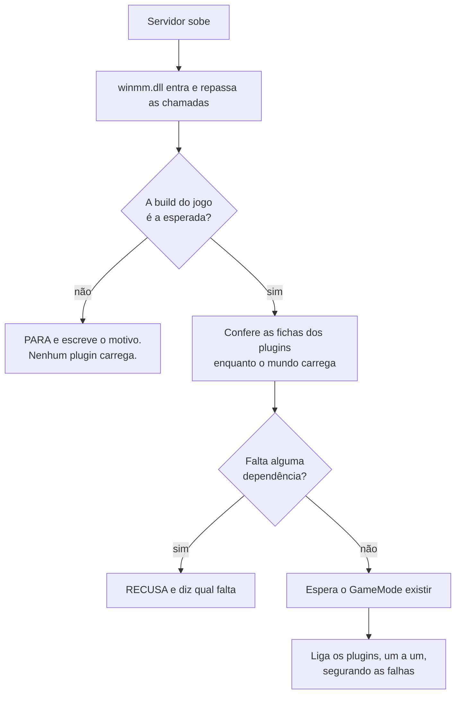

<p align="center">
  
</p>

<p align="center">
  <a href="README.md">&nbsp;<b>Portugu&ecirc;s</b></a>
  &nbsp;&nbsp;&middot;&nbsp;&nbsp;
  <a href="doc/README.en.md">&nbsp;English</a>
  &nbsp;&nbsp;&middot;&nbsp;&nbsp;
  <a href="doc/README.es.md">&nbsp;Espa&ntilde;ol</a>
</p>

# Conan-Api — plugins no seu servidor de Conan Exiles

O servidor dedicado do Conan Exiles não tem sistema de plugins. Não existe uma
pasta onde você joga um arquivo e ganha um recurso novo. Se você quer um `!kit`,
um sistema de VIP ou um teleporte, a resposta do jogo é simplesmente que isso
não existe.

**É esse buraco que esta API preenche.** Você copia dois itens para a pasta do
servidor, uma vez. A partir daí, instalar um plugin é arrastar uma pasta.

Se você já administrou servidor de ARK ou de ASA, é a mesma ideia do **ArkApi**
e do **AsaApi**, agora para Conan Exiles.

### "Mas já existe mod para isso"

Existe, e a diferença é uma só — mas ela decide tudo:

| | mod | plugin |
|---|---|---|
| o jogador precisa baixar | **sim** | não |
| aparece na lista do Workshop | sim | — |
| "não consigo entrar, falta mod" | acontece | não existe |
| atualiza quando o autor publica | o jogador tem que sincronizar | só você |
| quem instala | você **e** cada jogador | só você |

Um plugin roda **inteiro no servidor**. O jogador entra com o cliente limpo, sem
subscrição, sem sincronizar nada, sem descobrir na hora de entrar que falta um
arquivo. Para um servidor que quer jogador casual, isso é a diferença entre
alguém entrar e alguém desistir na tela de download.

O preço é que plugin não muda o que o cliente **desenha** — modelo novo, item
novo com arte própria, mapa. Isso continua sendo trabalho de mod. Plugin muda o
que o servidor **faz**: comandos, regras, economia, permissões, eventos.

```
Conan-Api/
   Plugins/
      Permission/            <- já vem junto: controla VIP e permissões
      LojaDoFulano/          <- você arrastou esta aqui
      TeleporteDoBeltrano/   <- e esta
```

Sem arquivo de configuração para editar. Sem lista para preencher. Sem comando
para rodar. **A pasta estar ali é a instalação.** Apagar a pasta é a
desinstalação.

---

## O que dá para ter no seu servidor

A API não faz nada sozinha — ela abre a porta para que outras pessoas escrevam
coisas. O que já é possível hoje, e está provado funcionando:

| o que o plugin faz | como o jogador usa |
|---|---|
| **comandos no chat** | ele digita `!kit`, `!online`, `!loja` e o plugin responde |
| **mensagem na tela** | aparece por cima da tela dele, sem passar pelo chat |
| **aviso para todos** | uma linha que chega a todo mundo conectado ao mesmo tempo |
| **reagir a eventos** | alguém entrou, morreu, coletou madeira, matou um NPC |
| **VIP e permissões** | quem pode o quê, com grupos, guardado em banco |
| **ler e mudar o mundo** | posição de um jogador, item no inventário, estado de um objeto |

Uma loja que vende itens pelo chat, um teleporte com pontos salvos, boas-vindas
personalizadas, kit diário só para VIP, aviso automático antes do restart — tudo
isso é escrito **por cima** desta API, por quem quiser.

O que existe hoje pronto é o **Permission**, que vem no pacote. O resto virá da
comunidade, e é para isso que o [SDK](../../../Conan-Api-SDK) existe.

---

## Antes de instalar qualquer coisa: leia isto

Um plugin é uma DLL que roda **dentro do processo do servidor**, com os mesmos
poderes que ele. Isso não é limitação desta API — é o que "plugin nativo"
significa em qualquer jogo. Mas você precisa saber antes, e em letra grande:

**Um plugin instalado pode** ler e alterar qualquer coisa na memória do
servidor, ver os dados de identidade dos seus jogadores, escrever qualquer
arquivo que o servidor alcance, abrir conexão de rede e derrubar o servidor.

**A API segura** falha de plugin ao carregar (o servidor sobe sem ele), erro
dentro de um hook na maioria dos casos, erro em tarefa que o plugin agendou para
depois (ele entra em quarentena e o servidor segue), e conflito entre dois
plugins.

**A API não segura** plugin malicioso. Não existe sandbox, e não vai existir.

Trate plugin como você trataria qualquer programa que instala no seu servidor:
de quem você confia, de preferência com o código à vista.

---

## Instalar — cinco minutos, uma vez só

Baixe o pacote em [Releases](../../releases). Vêm dois itens:

```
winmm.dll      o carregador. Sem ele, nada acontece.
Conan-Api/     a pasta com tudo dentro
```

**1.** Pare o servidor.

**2.** Vá até a pasta do executável:
`<servidor>\ConanSandbox\Binaries\Win64\`

**3.** Renomeie a `winmm.dll` **que já está lá** (a do Windows) para
`winmm_orig.dll`.

> Se já existir um `winmm_orig.dll` ali, **pare**: você já instalou antes.
> Renomear de novo faz o carregador apontar para ele mesmo, e o servidor morre
> em silêncio — sem log, sem erro, só não sobe. Apague a `winmm.dll` nova e
> recomece deste passo.

**4.** Copie a nossa `winmm.dll` e a pasta `Conan-Api` para essa mesma pasta.

**5.** Suba o servidor e abra `Conan-Api\Logs\ConanLoader.log`.

Se ele não existir, o carregador não entrou — reveja o passo 3.

### Por que renomear uma DLL do Windows?

Porque o servidor do Conan não tem onde encaixar um plugin. Ele não procura por
extensões, não lê pasta de módulos, não tem ponto de entrada nenhum.

O que ele faz, como todo programa Windows, é carregar as bibliotecas do sistema
ao iniciar — e a `winmm.dll` é uma delas. Nós entramos por ali: a nossa DLL tem
o nome que ele procura, e, ao ser carregada, ela **repassa todas as chamadas**
para a original que você renomeou. O jogo não perde nada; nós ganhamos um lugar
de onde trabalhar.

É por isso que o passo 3 importa tanto. Se a original não estiver como
`winmm_orig.dll`, as chamadas não têm para onde ir.

---

## Como o carregamento funciona, em português

Quando o servidor sobe, três coisas acontecem em ordem — e a ordem é a parte
importante:

**1. Nós entramos, mas não mexemos em nada.** A `winmm.dll` é carregada junto
com o servidor, repassa as chamadas do sistema e sai da frente. O jogo começa a
subir normalmente.

**2. Conferimos os plugins enquanto o mundo carrega.** Nesses segundos iniciais
a API abre cada DLL da pasta `Plugins/`, lê a ficha de cada uma, confere as
dependências e as versões. Se um plugin estiver quebrado, **você descobre aqui**
— no arranque, não meia hora depois.

**3. Ligamos os plugins quando o mundo existe.** E este passo espera de
propósito. Um plugin que procura jogadores antes de o mundo carregar encontra um
mundo pela metade e conclui coisa errada. Já aconteceu aqui: um plugin subiu
cedo demais e travou o servidor em 4,3 GB em vez dos 8,7 normais.

Mas a espera não é um cronômetro — é uma **pergunta ao jogo**. Assim que o
`GameMode` existe (a mesma condição que faz o servidor imprimir
`Match State ... InProgress`), os plugins entram. Antes isso era um tempo fixo,
e o resultado medido aqui foi de **12 minutos** entre o mundo estar pronto e o
primeiro plugin responder. Hoje são **cinco segundos**.



### O que você deve ver no log

```
== ConanLoader iniciado ==
[winmm] encaminhadores prontos: 189 apontam para a winmm_orig, 0 ficaram ausentes.
[conferencia] 1 plugin(s) na pasta, 0 ja reprovado(s) na conferencia de arquivos.
[fase1] 1 DLL(s) abertas e validadas, 0 reprovada(s).
mundo montado: achei o GameMode vivo ("ConanGameMode") com 92103 objetos.
  [ok] Permission  "Permissões"  v1.0.0  api>=2
== 1 plugin(s) carregado(s), 0 com falha ==
```

Cada plugin aparece com o nome, a versão e o veredito. Um `[x]` no lugar do
`[ok]` sempre vem com o motivo escrito ao lado.

---

## Instalar sem derrubar o servidor

Para adicionar um plugin **novo**, você não precisa mais parar tudo:

```
1. copie a pasta do plugin para Conan-Api/Plugins/
2. crie um arquivo vazio chamado CARREGAR-NOVOS, ao lado da pasta Logs/
```

Em até três segundos o carregador atende, faz as mesmas conferências de sempre e
liga o plugin. O log diz o resultado:

```
[novos] [ok] LojaDoFulano carregado SEM reiniciar o servidor.
```

**Trocar a versão de um plugin que já está rodando ainda exige reiniciar.** Isso
não é preguiça nossa: um plugin já carregado tem ganchos armados dentro do jogo,
e possivelmente tarefas esperando para rodar. Descarregar o código dele com
qualquer uma dessas coisas viva faz o servidor pular para um endereço que não
existe mais — e o problema aparece **depois**, longe da causa, num lugar que não
aponta para o plugin. Preferimos pedir um restart a entregar isso.

---

## O dia a dia

### O que precisa ter dentro da pasta de um plugin

Só a `.dll`. O resto depende de quem escreveu:

```
Conan-Api/Plugins/LojaDoFulano/
   LojaDoFulano.dll     <- a única coisa obrigatória
   PluginInfo.json      <- se existir, o log mostra nome e versão
   config.json          <- se existir, é do plugin: quem lê é ele, não a API
```

Se o autor não pôs um `PluginInfo.json`, o plugin ainda carrega — o log mostra
`[sem PluginInfo.json]` e usa o nome da pasta. O que você perde é saber a versão
dele pelo log, e a proteção que recusa o plugin numa API velha ou numa build do
jogo diferente.

**O `config.json` é do plugin, não nosso.** A API nunca abre esse arquivo; ela só
diz ao plugin onde ele fica. Se você precisa mudar alguma coisa nele, a
referência é a documentação de quem escreveu o plugin.

---

| você quer | você faz |
|---|---|
| instalar um plugin | arrasta a pasta para `Conan-Api/Plugins/` |
| instalar sem parar o servidor | copia a pasta e cria o arquivo `CARREGAR-NOVOS` |
| desinstalar | apaga a pasta |
| desligar sem perder a configuração | cria um arquivo vazio `DESLIGADO` dentro da pasta dele |
| entender o que aconteceu | abre `Conan-Api/Logs/ConanLoader.log` |

Se uma pasta tiver mais de uma `.dll`, o carregador usa a que tem o nome da
pasta. Se houver duas e nenhuma com o nome certo, ele **recusa e diz qual
renomear** — escolher "a primeira" mudaria conforme o sistema resolvesse listar,
e um dia carregaria a errada sem ninguém ver.

---


## O Permission — VIP e permissões

Vem junto no pacote, e é o plugin que os outros consultam quando precisam saber
quem pode o quê. Ele guarda tudo num banco dentro da própria pasta:

```
Conan-Api/Plugins/Permission/
   ConanPermission.dll
   config.json          <- nomes dos grupos, e onde fica o banco
   permission.db        <- nasce sozinho na primeira execução
```

**Se você não mexer em nada, funciona.** O banco local resolve para a maioria
dos servidores.

Se você tem **vários servidores** e quer o VIP compartilhado entre eles, é uma
linha no `config.json` apontando para um MySQL. Os plugins que consultam o
Permission não percebem diferença — a pergunta é a mesma nos dois casos.

E se o banco cair, o Permission responde "não sei" em vez de "não tem permissão".
Quem escreve plugin decide o que fazer com esse "não sei"; quem administra o
servidor não perde o VIP de ninguém por causa de uma queda de rede.

---

## Quando o Conan atualizar

A API vai **se recusar a carregar**, de propósito, e vai dizer isso no log.

Isso não é defeito, é a parte mais importante do projeto. Ela conhece o jogo por
endereços de memória de uma versão específica; quando a Funcom atualiza, esses
endereços mudam de lugar. Uma API que continuasse trabalhando estaria lendo
memória aleatória e devolvendo números que **parecem certos e não são** — VIP
sumindo, permissão invertida, e ninguém ligando o problema à atualização do jogo.

Prefira o servidor que não sobe com plugin ao servidor que sobe mentindo.

### "Mas ela não sabe se reencontrar sozinha?"

Sim, e as duas coisas não se contradizem — são etapas diferentes:

**Achar os endereços novos é automático.** A API não guarda os endereços como
números: ela os encontra por padrões de bytes no executável do jogo. Quando a
Funcom recompila, o layout muda mas o código em volta de cada âncora continua
reconhecível, e uma ferramenta lê os endereços novos direto do `.exe` — sem
precisar nem subir o servidor.

**Carregar assim mesmo não é.** A conferência de build é deliberada e vem antes
de tudo. "Encontrei os endereços" não é o mesmo que "conferi que tudo continua
no lugar": os offsets dos campos dentro das classes também mudam, e esses
precisam ser recolhidos com o servidor rodando. Enquanto isso não é feito e
verificado, a API prefere não subir.

**Quanto tempo isso leva, na prática?** Não sabemos. Este projeto é anterior ao
primeiro patch do Enhanced desde que ele existe — todas as versões publicadas
até hoje são da mesma build (`24784646`). O mecanismo está testado contra um
executável modificado por nós de propósito, mas **nunca contra uma atualização
real da Funcom**. Quando a primeira chegar, esta seção ganha um número medido no
lugar desta frase.

### E os plugins que você instalou?

A maioria continua valendo. Um plugin conversa com a API por uma tabela de
funções, e essa tabela não muda de forma quando o jogo atualiza — quem é refeita
é a API.

A exceção são os plugins que gravaram **endereços do jogo** dentro do próprio
binário. Esses passam a ler o lugar errado depois de um patch, e o pior é que
não dá erro: eles funcionam, só que com dado errado.

Por isso o autor pode declarar isso na ficha do plugin dele. Quando declara, e a
build muda, **o carregador recusa** e escreve o motivo:

```
[x] LojaDoFulano — feito para a build 24383534 do jogo; esta e' a 24784646.
    Ele usa offset cru: carregar aqui faria ele ler memoria errada SEM erro
    nenhum. Peca a versao nova ao autor.
```

Se um plugin sumir da sua lista depois de uma atualização, procure essa linha
antes de qualquer outra coisa: ela diz exatamente o que aconteceu e o que pedir
ao autor.

---

## Quando alguma coisa não funciona

**"Instalei e nenhum plugin funciona"** — abra `Conan-Api\Logs\ConanLoader.log`.
Se o arquivo nem existe, o carregador não entrou: a `winmm.dll` não está ao lado
do executável, ou você esqueceu de renomear a original.

**"O servidor não sobe e não diz nada"** — quase sempre é `winmm_orig.dll`
apontando para si mesma, de uma instalação por cima de outra. Veja o passo 3.

**"Um plugin específico não carrega"** — o log diz o motivo, com o nome da pasta.
Costuma ser DLL faltando, ficha exigindo uma API mais nova, ou um arquivo
`DESLIGADO` esquecido lá dentro.

**"Instalei com CARREGAR-NOVOS e não aconteceu nada"** — o arquivo é apagado
assim que é atendido. Se ele continua lá depois de alguns segundos, o carregador
não está rodando: confira o log do arranque.

---


## Escrever seus próprios plugins

É outro repositório: **[Conan-Api-SDK](../../../Conan-Api-SDK)**. Lá estão o
header, exemplos com código-fonte e o guia de compilação.

São separados de propósito: quem administra um servidor não precisa de
compilador para nada, e quem escreve plugin não precisa dos binários do
servidor.

---

## Licença, em três linhas

**Você pode rodar isto em quantos servidores quiser, inclusive em servidor que
cobra dos jogadores.** Não há taxa, não há autorização a pedir.

**Você pode divulgar e indexar o link deste repositório em qualquer lugar** —
site, fórum, vídeo, lista de recursos. O link é livre.

**O que não pode é revender ou re-hospedar a API.** Nada de espelhar o download,
embutir os arquivos em outro pacote ou incluí-la em qualquer coisa comercial.
Quem quiser a API pega aqui.

Plugins são outra história e não são nossos: quem escreve um decide a licença
dele, e pode vendê-lo. O texto completo está no [LICENSE](LICENSE).

---

## Créditos e licença

*Conan Exiles* é da **Funcom**. As imagens deste repositório são material de
divulgação oficial, do Steam. Este projeto não tem vínculo com a Funcom nem com
a Inflexion Games.

Esta API é trabalho independente, feito por engenharia reversa do servidor
dedicado, sem SDK oficial e sem símbolos de depuração.

<p align="center">
  <a href="README.md">&nbsp;<b>Portugu&ecirc;s</b></a>
  &nbsp;&nbsp;&middot;&nbsp;&nbsp;
  <a href="doc/README.en.md">&nbsp;English</a>
  &nbsp;&nbsp;&middot;&nbsp;&nbsp;
  <a href="doc/README.es.md">&nbsp;Espa&ntilde;ol</a>
</p>
