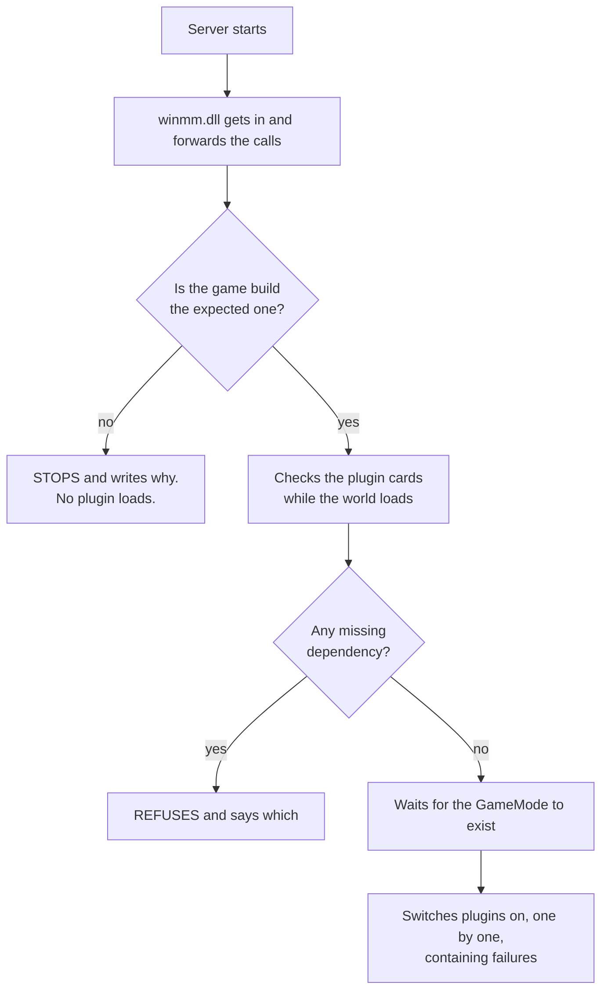

<p align="center">
  
</p>

<p align="center">
  <a href="../README.md">&nbsp;Portugu&ecirc;s</a>
  &nbsp;&nbsp;&middot;&nbsp;&nbsp;
  <a href="README.en.md">&nbsp;<b>English</b></a>
  &nbsp;&nbsp;&middot;&nbsp;&nbsp;
  <a href="README.es.md">&nbsp;Espa&ntilde;ol</a>
</p>

# Conan-Api — plugins on your Conan Exiles server

The Conan Exiles dedicated server has no plugin system. There is no folder where
you drop a file and get a new feature. If you want a `!kit`, a VIP system or a
teleport, the game's answer is simply that those do not exist.

**This API fills that gap.** You copy two items into the server folder, once.
From then on, installing a plugin means dragging a folder.

If you have run an ARK or ASA server before, this is the same idea as **ArkApi**
and **AsaApi**, now for Conan Exiles.

### "But there are already mods for that"

There are, and the difference is a single one — but it decides everything:

| | mod | plugin |
|---|---|---|
| the player has to download it | **yes** | no |
| shows up in the Workshop list | yes | — |
| "I can't join, a mod is missing" | happens | does not exist |
| updates when the author publishes | the player has to sync | only you |
| who installs it | you **and** every player | only you |

A plugin runs **entirely on the server**. The player joins with a clean client:
no subscription, nothing to sync, no discovering at join time that a file is
missing. For a server that wants casual players, that is the difference between
someone joining and someone giving up at the download screen.

The price is that a plugin cannot change what the client **draws** — new models,
new items with their own art, maps. That is still mod work. A plugin changes what
the server **does**: commands, rules, economy, permissions, events.

```
Conan-Api/
   Plugins/
      Permission/            <- ships with it: VIP and permissions
      SomeonesShop/          <- you dragged this one here
      SomeonesTeleport/      <- and this one
```

No config file to edit. No list to fill in. No command to run. **The folder being
there is the installation.** Deleting the folder is the uninstall.

---

## What you can have on your server

The API does nothing on its own — it opens the door for other people to write
things. What is possible today, and proven working:

| what a plugin does | how the player uses it |
|---|---|
| **chat commands** | they type `!kit`, `!online`, `!shop` and the plugin answers |
| **on-screen message** | it appears over their screen, never touching chat |
| **broadcast** | one line that reaches everyone connected at the same time |
| **react to events** | someone joined, died, harvested wood, killed an NPC |
| **VIP and permissions** | who can do what, with groups, stored in a database |
| **read and change the world** | a player's position, an item in an inventory, an object's state |

A shop that sells items through chat, a teleport with saved points, custom
welcome messages, a daily kit for VIPs only, an automatic warning before restart
— all of that is written **on top of** this API, by anyone who wants to.

What exists ready today is **Permission**, which ships in the package. The rest
will come from the community, and that is what the
[SDK](../../../Conan-Api-SDK) is for.

---

## Before you install anything: read this

A plugin is a DLL that runs **inside the server process**, with the same powers
it has. That is not a limitation of this API — it is what "native plugin" means
in any game. But you need to know it first, in large print:

**An installed plugin can** read and change anything in the server's memory, see
your players' identity data, write any file the server can reach, open network
connections, and crash the server.

**The API contains** a plugin failing at load (the server comes up without it),
an error inside a hook in most cases, an error in work the plugin scheduled for
later (it goes into quarantine and the server carries on), and conflicts between
two plugins.

**The API does not contain** a malicious plugin. There is no sandbox, and there
will not be one.

Treat a plugin the way you would treat any program you install on your server:
from someone you trust, preferably with the source in plain sight.

---

## Install — five minutes, once

Download the package from [Releases](../../releases). Two items come in it:

```
winmm.dll      the loader. Without it, nothing happens.
Conan-Api/     the folder with everything inside
```

**1.** Stop the server.

**2.** Go to the executable's folder:
`<server>\ConanSandbox\Binaries\Win64\`

**3.** Rename the `winmm.dll` **already there** (Windows' own) to
`winmm_orig.dll`.

> If a `winmm_orig.dll` already exists, **stop**: you have installed before.
> Renaming again makes the loader point at itself, and the server dies silently
> — no log, no error, it just does not come up. Delete the new `winmm.dll` and
> start again from this step.

**4.** Copy our `winmm.dll` and the `Conan-Api` folder into that same folder.

**5.** Start the server and open `Conan-Api\Logs\ConanLoader.log`.

If that file does not exist, the loader never got in — go back to step 3.

### Why rename a Windows DLL?

Because the Conan server has nowhere to plug a plugin into. It does not look for
extensions, does not read a module folder, has no entry point at all.

What it does, like every Windows program, is load the system libraries at
startup — and `winmm.dll` is one of them. That is how we get in: our DLL has the
name it looks for, and once loaded it **forwards every call** to the original
you renamed. The game loses nothing; we gain a place to work from.

That is why step 3 matters so much. If the original is not sitting there as
`winmm_orig.dll`, the calls have nowhere to go.

---

## How loading works, in plain words

When the server starts, three things happen in order — and the order is the
important part:

**1. We get in, but touch nothing.** `winmm.dll` is loaded along with the
server, forwards the system calls and steps aside. The game starts up normally.

**2. We check the plugins while the world loads.** In those first seconds the
API opens every DLL in `Plugins/`, reads each one's card, checks dependencies
and versions. If a plugin is broken, **you find out here** — at startup, not
half an hour later.

**3. We switch the plugins on when the world exists.** And this step waits on
purpose. A plugin that looks for players before the world has loaded finds a
half-built world and concludes the wrong thing. It happened here: a plugin came
up too early and froze the server at 4.3 GB instead of the usual 8.7.

But the wait is not a timer — it is a **question to the game**. As soon as the
`GameMode` exists (the same condition that makes the server print
`Match State ... InProgress`), the plugins come in. This used to be a fixed
delay, and the measured result here was **12 minutes** between the world being
ready and the first plugin answering. Today it is **five seconds**.



### What you should see in the log

```
== ConanLoader iniciado ==
[winmm] encaminhadores prontos: 189 apontam para a winmm_orig, 0 ficaram ausentes.
[conferencia] 1 plugin(s) na pasta, 0 ja reprovado(s) na conferencia de arquivos.
[fase1] 1 DLL(s) abertas e validadas, 0 reprovada(s).
mundo montado: achei o GameMode vivo ("ConanGameMode") com 92103 objetos.
  [ok] Permission  "Permissões"  v1.0.0  api>=2
== 1 plugin(s) carregado(s), 0 com falha ==
```

Each plugin shows up with its name, version and verdict. An `[x]` instead of
`[ok]` always comes with the reason written next to it.

---

## Installing without taking the server down

To add a **new** plugin you no longer have to stop everything:

```
1. copy the plugin's folder into Conan-Api/Plugins/
2. create an empty file named CARREGAR-NOVOS, next to the Logs/ folder
```

Within three seconds the loader picks it up, runs the same checks as always and
switches the plugin on. The log says what happened:

```
[novos] [ok] SomeonesShop carregado SEM reiniciar o servidor.
```

**Replacing the version of a plugin that is already running still needs a
restart.** That is not laziness on our part: a loaded plugin has hooks armed
inside the game, and possibly tasks waiting to run. Unloading its code with any
of those alive makes the server jump to an address that no longer exists — and
the problem shows up **later**, far from the cause, somewhere that does not
point back at the plugin. We would rather ask for a restart than ship that.

---

## Day to day

### What has to be inside a plugin's folder

Only the `.dll`. The rest is up to whoever wrote it:

```
Conan-Api/Plugins/SomeonesShop/
   SomeonesShop.dll     <- the only required item
   PluginInfo.json      <- if present, the log shows name and version
   config.json          <- if present, it belongs to the plugin: it reads it, not the API
```

If the author did not include a `PluginInfo.json`, the plugin still loads — the
log shows `[sem PluginInfo.json]` and uses the folder name. What you lose is
knowing its version from the log, and the protection that refuses the plugin on
an old API or on a different game build.

**`config.json` belongs to the plugin, not to us.** The API never opens that
file; it only tells the plugin where it lives. If you need to change something in
it, the reference is the documentation of whoever wrote the plugin.

---

| you want to | you do |
|---|---|
| install a plugin | drag its folder into `Conan-Api/Plugins/` |
| install without stopping the server | copy the folder and create the `CARREGAR-NOVOS` file |
| uninstall | delete the folder |
| switch off without losing the config | create an empty file named `DESLIGADO` inside its folder |
| understand what happened | open `Conan-Api/Logs/ConanLoader.log` |

If a folder holds more than one `.dll`, the loader uses the one named after the
folder. If there are two and none with the right name, it **refuses and says
which one to rename** — picking "the first" would change with whatever order the
filesystem felt like listing, and one day it would load the wrong one unnoticed.

---


## Permission — VIP and permissions

It ships in the package, and it is the plugin the others ask when they need to
know who can do what. It keeps everything in a database inside its own folder:

```
Conan-Api/Plugins/Permission/
   ConanPermission.dll
   config.json          <- group names, and where the database lives
   permission.db        <- born on its own at first run
```

**If you change nothing, it works.** The local database is enough for most
servers.

If you run **several servers** and want VIP shared between them, it is one line
in `config.json` pointing at a MySQL. Plugins that query Permission notice no
difference — the question is the same either way.

And if the database goes down, Permission answers "I do not know" instead of
"no permission". Plugin authors decide what to do with that "I do not know";
you, running the server, do not lose anyone's VIP over a network hiccup.

---

## When Conan updates

The API will **refuse to load**, on purpose, and will say so in the log.

That is not a defect, it is the most important part of the project. It knows the
game by memory addresses from one specific version; when Funcom updates, those
addresses move. An API that kept working would be reading random memory and
handing back numbers that **look right and are not** — VIP vanishing,
permissions inverted, and nobody connecting the problem to the game update.

Prefer the server that will not come up with plugins over the server that comes
up lying.

### "But doesn't it find its own way around?"

It does, and the two things do not contradict each other — they are different
steps:

**Finding the new addresses is automatic.** The API does not store addresses as
numbers: it finds them by byte patterns in the game executable. When Funcom
recompiles, the layout moves but the code around each anchor stays recognisable,
and a tool reads the new addresses straight from the `.exe` — without even
starting the server.

**Loading anyway is not.** The build check is deliberate and comes before
everything else. "I found the addresses" is not the same as "I verified that
everything is still in place": the offsets of fields inside classes move too, and
those have to be re-collected with the server running. Until that is done and
verified, the API would rather not come up.

**How long does that take in practice?** We do not know. This project predates
the first Enhanced patch since it has existed — every version published so far
is for the same build (`24784646`). The mechanism is tested against an executable
we modified on purpose, but **never against a real Funcom update**. When the
first one lands, this section gets a measured number in place of this
sentence.

### What about the plugins you installed?

Most keep working. A plugin talks to the API through a function table, and that
table does not change shape when the game updates — what gets rebuilt is the
API.

The exception is a plugin that baked **game addresses** into its own binary.
Those start reading the wrong place after a patch, and the worst part is that
nothing errors out: they run, just with wrong data.

That is why the author can declare it in their plugin's card. When they do, and
the build changes, **the loader refuses** and writes the reason:

```
[x] SomeonesShop — feito para a build 24383534 do jogo; esta e' a 24784646.
    Ele usa offset cru: carregar aqui faria ele ler memoria errada SEM erro
    nenhum. Peca a versao nova ao autor.
```

If a plugin disappears from your list after an update, look for that line before
anything else: it says exactly what happened and what to ask the author for.

---

## When something does not work

**"I installed it and no plugin works"** — open
`Conan-Api\Logs\ConanLoader.log`. If the file does not even exist, the loader
never got in: `winmm.dll` is not next to the executable, or you forgot to rename
the original.

**"The server does not come up and says nothing"** — almost always
`winmm_orig.dll` pointing at itself, from installing over a previous install.
See step 3.

**"One specific plugin will not load"** — the log gives the reason, with the
folder name. Usually a missing DLL, a card asking for a newer API, or a
`DESLIGADO` file left behind inside.

**"I installed with CARREGAR-NOVOS and nothing happened"** — the file is deleted
as soon as it is picked up. If it is still there after a few seconds, the loader
is not running: check the startup log.

---


## Writing your own plugins

That is another repository: **[Conan-Api-SDK](../../../Conan-Api-SDK)**. The
header, examples with source code and the build guide live there.

They are separate on purpose: someone running a server needs no compiler at all,
and someone writing a plugin needs none of the server binaries.

---

## Licence, in three lines

**You may run this on as many servers as you like, including a server that
charges its players.** No fee, no authorisation to ask for.

**You may share and index this repository's link anywhere** — site, forum,
video, resource list. The link is free.

**What you may not do is resell or re-host the API.** No mirroring the download,
no embedding the files in another package, no including it in anything
commercial. Whoever wants the API gets it here.

Plugins are a different story and are not ours: whoever writes one chooses its
licence, and may sell it. The full text is in [LICENSE](../LICENSE).

---

## Credits and licence

*Conan Exiles* belongs to **Funcom**. The images in this repository are official
promotional material, from Steam. This project has no affiliation with Funcom or
Inflexion Games.

This API is independent work, done by reverse engineering the dedicated server,
with no official SDK and no debug symbols.

<p align="center">
  <a href="../README.md">&nbsp;Portugu&ecirc;s</a>
  &nbsp;&nbsp;&middot;&nbsp;&nbsp;
  <a href="README.en.md">&nbsp;<b>English</b></a>
  &nbsp;&nbsp;&middot;&nbsp;&nbsp;
  <a href="README.es.md">&nbsp;Espa&ntilde;ol</a>
</p>
