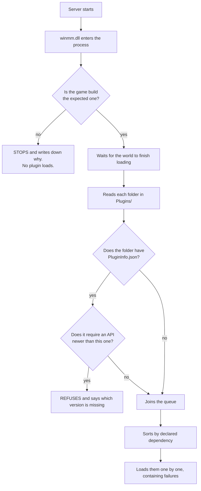

<p align="center">
  <a href="../README.md">&nbsp;Portugu&ecirc;s</a>
  &nbsp;&nbsp;&middot;&nbsp;&nbsp;
  <a href="README.en.md">&nbsp;<b>English</b></a>
  &nbsp;&nbsp;&middot;&nbsp;&nbsp;
  <a href="README.es.md">&nbsp;Espa&ntilde;ol</a>
</p>

# Conan-Api — plugins on your Conan Exiles server

The Conan Exiles dedicated server has no plugin system. There is no folder where
you drop a file and get a new feature. If you want a `/kit`, a VIP system or a
teleport, the game's answer is that this does not exist.

This API fixes that. You copy two things into the server folder, and from then
on installing a plugin is **dragging a folder**.

```
Conan-Api/
   Plugins/
      Permission/            <- ships with it, handles VIP and permissions
      PluginYouDownloaded/   <- you dragged this folder here
```

That is all. There is no configuration file to edit, no list to fill in, no
command to run. The folder being there is the installation.

---

## Before anything else: this runs inside your server

A plugin is a DLL that runs **inside the server process**, with the same powers
it has. That is not a limitation of this API — it is what "native plugin" means
in any game. But it has to be said before you install anything, and in large
letters:

**An installed plugin can** read and change anything in the server's memory,
read your players' identity data, write any file the server can reach, open a
network connection, and bring the server down.

**The API contains** a plugin failing to load (the server comes up without it),
an exception inside a hook in most cases, and a conflict between two plugins.
**The API does not contain** a malicious plugin: there is no sandbox, and there
will not be one.

Treat a plugin the way you would treat any program you install on your server:
from someone you trust, preferably with the source in plain sight.

---

## Install — five minutes

Download the package from [Releases](../../../releases). You get two things:

```
winmm.dll      the loader. Without it, nothing happens.
Conan-Api/     the folder with everything inside
```

**1.** Stop the server.

**2.** Go to the executable's folder:
`<server>\ConanSandbox\Binaries\Win64\`

**3.** Rename the `winmm.dll` **that is already there** (the Windows one) to
`winmm_orig.dll`.

> If a `winmm_orig.dll` already exists there, **stop**: you have installed
> before. Renaming again makes the loader point at itself, and the server dies
> in silence — no log, no error, it just does not come up. Delete the new
> `winmm.dll` and start over from this step.

**4.** Copy the `winmm.dll` (ours) and the `Conan-Api` folder into that same
folder.

**5.** Start the server and open `Conan-Api\Logs\ConanLoader.log`. It should
look like this:

```
== ConanLoader iniciado ==
[winmm] encaminhadores prontos: 189 apontam para a winmm_orig, 0 ficaram ausentes.
reflexao estavel: 1508584 objetos vivos (nao cresceu alem de ~2% por 120 s).
1 pasta(s) de plugin encontrada(s).
  [ok] Permission  "Permissões"  v1.0.0  api>=2
       Permissões, grupos e VIP. Outros plugins consultam por ConanPermission.h.
== 1 plugin(s) carregado(s), 0 com falha ==
```

The loader writes that log in Portuguese, exactly as printed above — the line
that matters is the last one, `1 plugin(s) carregado(s), 0 com falha`: one plugin
loaded, none failed. If that file is never created, the loader did not get in —
go back to step 3.

---

## How the loader decides what to load



**It waits for the world to load on purpose.** A plugin that looks for players
before that finds a half-built world and concludes the wrong thing. It happened
here: a plugin came up too early and froze the server at 4.3 GB instead of the
usual 8.7.

---

## Install, uninstall, turn off

| what you want | what you do |
|---|---|
| install a plugin | drag its folder into `Conan-Api/Plugins/` |
| uninstall | delete the folder |
| turn it off without losing its configuration | create an empty file named `DESLIGADO` inside its folder — that is the literal name the loader looks for, Portuguese for "off", all caps and no extension |
| find out what happened | open `Conan-Api/Logs/ConanLoader.log` |

If a folder has more than one `.dll`, the loader uses the one named after the
folder. If there are two and neither carries the right name, it **refuses and
tells you which one to rename** — picking "the first one" would change with
whatever order the filesystem happened to list them in, and one day it would
load the wrong one with nobody seeing it.

---

## Permission — VIP and permissions

It ships with the API and it is the plugin the others query. It keeps who has
what in a local database, inside its own folder:

```
Conan-Api/Plugins/Permission/
   ConanPermission.dll
   config.json          <- the group names, and the database (see below)
   permission.db        <- created on its own on the first run
```

**If you touch nothing**, it uses that local database and it works. If you want
MySQL — because you run several servers and want VIP shared between them — that
is one line in `config.json`.

---

## When Conan updates

The API will **refuse to load**, on purpose, and it will say so in the log.

That is not a defect. It knows the game by memory addresses of this specific
version; when Funcom updates, those addresses move. An API that kept working
would be reading random memory and handing back plausible, false numbers — your
VIP would vanish, permissions would invert, and nobody would connect the problem
to the game update.

Prefer the server that will not come up with plugins over the server that comes
up lying. When that happens, wait for an updated version here.

---

## Common problems

**"I installed it and no plugin works"** — open `Conan-Api\Logs\ConanLoader.log`.
If the file does not exist, the loader did not get in: the `winmm.dll` is not
next to the executable, or you forgot to rename the original one.

**"The server does not come up and says nothing"** — almost always a
`winmm_orig.dll` pointing at itself (an install on top of another one). See step 3.

**"One specific plugin does not load"** — the log gives the reason, with the
folder name. It can be a missing DLL, a `PluginInfo.json` demanding a newer API,
or a `DESLIGADO` file left behind inside it.

---


## Writing your own plugins

That is another repository: **[Conan-Api-SDK](../../../../Conan-Api-SDK)**. It has
the header, six examples with source code and the build guide. They are separate
because whoever runs a server needs no compiler for anything, and whoever writes
a plugin needs none of the server binaries.

---

## Credits and license

*Conan Exiles* belongs to **Funcom**. The images in this repository are official
promotional material, from Steam. This project has no affiliation with Funcom or
with Inflexion Games.

This API is independent work, done by reverse engineering the dedicated server,
with no official SDK and no debug symbols.

<p align="center">
  <a href="../README.md">&nbsp;Portugu&ecirc;s</a>
  &nbsp;&nbsp;&middot;&nbsp;&nbsp;
  <a href="README.en.md">&nbsp;<b>English</b></a>
  &nbsp;&nbsp;&middot;&nbsp;&nbsp;
  <a href="README.es.md">&nbsp;Espa&ntilde;ol</a>
</p>
