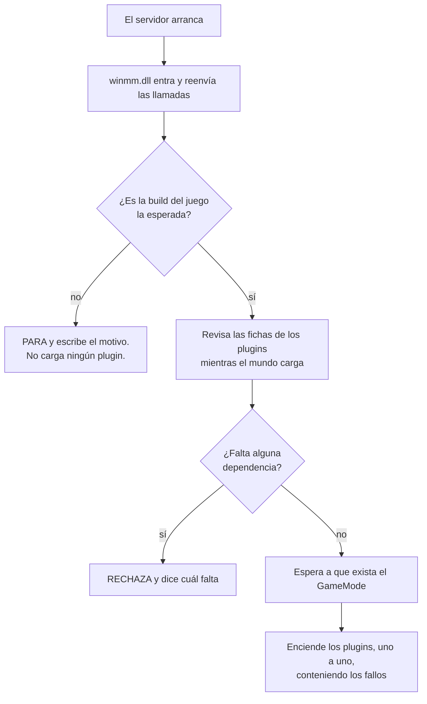
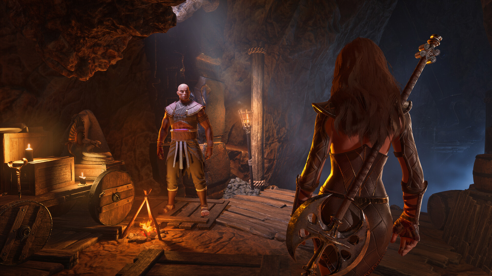

<p align="center">
  
</p>

<p align="center">
  <a href="../README.md">&nbsp;Portugu&ecirc;s</a>
  &nbsp;&nbsp;&middot;&nbsp;&nbsp;
  <a href="README.en.md">&nbsp;English</a>
  &nbsp;&nbsp;&middot;&nbsp;&nbsp;
  <a href="README.es.md">&nbsp;<b>Espa&ntilde;ol</b></a>
</p>

# Conan-Api — plugins en tu servidor de Conan Exiles

El servidor dedicado de Conan Exiles no tiene sistema de plugins. No existe una
carpeta donde sueltas un archivo y ganas una función nueva. Si quieres un
`!kit`, un sistema de VIP o un teletransporte, la respuesta del juego es
simplemente que eso no existe.

**Esta API llena ese hueco.** Copias dos cosas a la carpeta del servidor, una
vez. A partir de ahí, instalar un plugin es arrastrar una carpeta.

Si ya administraste un servidor de ARK o de ASA, es la misma idea del **ArkApi**
y del **AsaApi**, ahora para Conan Exiles.

### "Pero ya hay mods para eso"

Los hay, y la diferencia es una sola — pero lo decide todo:

| | mod | plugin |
|---|---|---|
| el jugador tiene que descargarlo | **sí** | no |
| aparece en la lista del Workshop | sí | — |
| "no puedo entrar, falta un mod" | pasa | no existe |
| se actualiza cuando el autor publica | el jugador tiene que sincronizar | solo tú |
| quién lo instala | tú **y** cada jugador | solo tú |

Un plugin corre **entero en el servidor**. El jugador entra con el cliente
limpio: sin suscripción, sin sincronizar nada, sin descubrir al entrar que falta
un archivo. Para un servidor que quiere jugador casual, esa es la diferencia
entre que alguien entre y que alguien se rinda en la pantalla de descarga.

El precio es que un plugin no cambia lo que el cliente **dibuja** — modelos
nuevos, objetos con arte propia, mapas. Eso sigue siendo trabajo de mod. Un
plugin cambia lo que el servidor **hace**: comandos, reglas, economía, permisos,
eventos.

```
Conan-Api/
   Plugins/
      Permission/            <- viene incluido: VIP y permisos
      TiendaDeAlguien/       <- arrastraste esta aquí
      TeleporteDeAlguien/    <- y esta
```

Sin archivo de configuración que editar. Sin lista que rellenar. Sin comando que
ejecutar. **Que la carpeta esté ahí es la instalación.** Borrar la carpeta es la
desinstalación.

---

## Lo que puedes tener en tu servidor

La API no hace nada por sí sola — abre la puerta para que otras personas
escriban cosas. Lo que ya es posible hoy, y está probado funcionando:

| lo que hace un plugin | cómo lo usa el jugador |
|---|---|
| **comandos en el chat** | escribe `!kit`, `!online`, `!tienda` y el plugin responde |
| **mensaje en pantalla** | aparece sobre su pantalla, sin pasar por el chat |
| **aviso para todos** | una línea que llega a todos los conectados a la vez |
| **reaccionar a eventos** | alguien entró, murió, recogió madera, mató a un NPC |
| **VIP y permisos** | quién puede qué, con grupos, guardado en base de datos |
| **leer y cambiar el mundo** | la posición de un jugador, un objeto del inventario, el estado de algo |

Una tienda que vende objetos por el chat, un teletransporte con puntos
guardados, bienvenidas personalizadas, un kit diario solo para VIP, un aviso
automático antes del reinicio — todo eso se escribe **encima** de esta API, por
quien quiera.

Lo que existe listo hoy es **Permission**, que viene en el paquete. El resto
vendrá de la comunidad, y para eso está el [SDK](../../../Conan-Api-SDK).

---

## Antes de instalar nada: lee esto

Un plugin es una DLL que corre **dentro del proceso del servidor**, con los
mismos poderes que él. Eso no es una limitación de esta API — es lo que
significa "plugin nativo" en cualquier juego. Pero tienes que saberlo antes, y
en letra grande:

**Un plugin instalado puede** leer y cambiar cualquier cosa en la memoria del
servidor, ver los datos de identidad de tus jugadores, escribir cualquier
archivo que el servidor alcance, abrir conexiones de red y tumbar el servidor.

**La API contiene** el fallo de un plugin al cargar (el servidor arranca sin
él), un error dentro de un hook en la mayoría de los casos, un error en trabajo
que el plugin programó para después (pasa a cuarentena y el servidor sigue), y
conflictos entre dos plugins.

**La API no contiene** un plugin malicioso. No hay sandbox, y no la habrá.

Trata a un plugin como tratarías a cualquier programa que instalas en tu
servidor: de alguien en quien confías, preferiblemente con el código a la vista.

---

## Instalar — cinco minutos, una sola vez

Descarga el paquete en [Releases](../../releases). Vienen dos cosas:

```
winmm.dll      el cargador. Sin él no pasa nada.
Conan-Api/     la carpeta con todo dentro
```

**1.** Detén el servidor.

**2.** Ve a la carpeta del ejecutable:
`<servidor>\ConanSandbox\Binaries\Win64\`

**3.** Renombra la `winmm.dll` **que ya está ahí** (la de Windows) a
`winmm_orig.dll`.

> Si ya existe un `winmm_orig.dll`, **para**: ya instalaste antes. Renombrar de
> nuevo hace que el cargador apunte a sí mismo, y el servidor muere en silencio
> — sin log, sin error, simplemente no arranca. Borra la `winmm.dll` nueva y
> empieza otra vez desde este paso.

**4.** Copia nuestra `winmm.dll` y la carpeta `Conan-Api` a esa misma carpeta.

**5.** Arranca el servidor y abre `Conan-Api\Logs\ConanLoader.log`.

Si ese archivo no existe, el cargador no entró — revisa el paso 3.

### ¿Por qué renombrar una DLL de Windows?

Porque el servidor de Conan no tiene dónde encajar un plugin. No busca
extensiones, no lee una carpeta de módulos, no tiene punto de entrada ninguno.

Lo que sí hace, como todo programa de Windows, es cargar las bibliotecas del
sistema al arrancar — y `winmm.dll` es una de ellas. Por ahí entramos: nuestra
DLL tiene el nombre que él busca, y al cargarse **reenvía todas las llamadas** a
la original que renombraste. El juego no pierde nada; nosotros ganamos un sitio
desde donde trabajar.

Por eso el paso 3 importa tanto. Si la original no está como `winmm_orig.dll`,
las llamadas no tienen a dónde ir.

---

## Cómo funciona la carga, en cristiano

Cuando el servidor arranca pasan tres cosas en orden — y el orden es lo
importante:

**1. Entramos, pero no tocamos nada.** La `winmm.dll` se carga junto con el
servidor, reenvía las llamadas del sistema y se aparta. El juego arranca
normalmente.

**2. Revisamos los plugins mientras el mundo carga.** En esos primeros segundos
la API abre cada DLL de `Plugins/`, lee la ficha de cada una, comprueba
dependencias y versiones. Si un plugin está roto, **te enteras aquí** — en el
arranque, no media hora después.

**3. Encendemos los plugins cuando el mundo existe.** Y este paso espera a
propósito. Un plugin que busca jugadores antes de que el mundo cargue encuentra
un mundo a medias y concluye algo equivocado. Ya pasó aquí: un plugin arrancó
demasiado pronto y dejó el servidor congelado en 4,3 GB en vez de los 8,7
normales.

Pero la espera no es un cronómetro — es una **pregunta al juego**. En cuanto el
`GameMode` existe (la misma condición que hace que el servidor imprima
`Match State ... InProgress`), los plugins entran. Antes era un tiempo fijo, y
el resultado medido aquí fue de **12 minutos** entre el mundo estar listo y el
primer plugin responder. Hoy son **cinco segundos**.



### Lo que deberías ver en el log

```
== ConanLoader iniciado ==
[winmm] encaminhadores prontos: 189 apontam para a winmm_orig, 0 ficaram ausentes.
[conferencia] 1 plugin(s) na pasta, 0 ja reprovado(s) na conferencia de arquivos.
[fase1] 1 DLL(s) abertas e validadas, 0 reprovada(s).
mundo montado: achei o GameMode vivo ("ConanGameMode") com 92103 objetos.
  [ok] Permission  "Permissões"  v1.0.0  api>=2
== 1 plugin(s) carregado(s), 0 com falha ==
```

Cada plugin aparece con su nombre, su versión y el veredicto. Una `[x]` en lugar
de `[ok]` siempre viene con el motivo escrito al lado.

---

## Instalar sin tumbar el servidor

Para añadir un plugin **nuevo** ya no hace falta parar todo:

```
1. copia la carpeta del plugin a Conan-Api/Plugins/
2. crea un archivo vacío llamado CARREGAR-NOVOS, junto a la carpeta Logs/
```

En menos de tres segundos el cargador lo atiende, hace las mismas comprobaciones
de siempre y enciende el plugin. El log dice el resultado:

```
[novos] [ok] TiendaDeAlguien carregado SEM reiniciar o servidor.
```

**Cambiar la versión de un plugin que ya está corriendo sigue exigiendo
reiniciar.** No es pereza nuestra: un plugin ya cargado tiene ganchos armados
dentro del juego, y posiblemente tareas esperando para ejecutarse. Descargar su
código con cualquiera de esas cosas viva hace que el servidor salte a una
dirección que ya no existe — y el problema aparece **después**, lejos de la
causa, en un sitio que no apunta al plugin. Preferimos pedir un reinicio a
entregar eso.

---

## El día a día

### Qué tiene que haber dentro de la carpeta de un plugin

Solo la `.dll`. El resto depende de quien lo escribió:

```
Conan-Api/Plugins/TiendaDeAlguien/
   TiendaDeAlguien.dll  <- lo único obligatorio
   PluginInfo.json      <- si existe, el log muestra nombre y versión
   config.json          <- si existe, es del plugin: lo lee él, no la API
```

Si el autor no puso un `PluginInfo.json`, el plugin igual carga — el log muestra
`[sem PluginInfo.json]` y usa el nombre de la carpeta. Lo que pierdes es saber su
versión por el log, y la protección que rechaza el plugin en una API vieja o en
una build del juego distinta.

**El `config.json` es del plugin, no nuestro.** La API nunca abre ese archivo;
solo le dice al plugin dónde vive. Si necesitas cambiar algo ahí, la referencia
es la documentación de quien escribió el plugin.

---

| quieres | haces |
|---|---|
| instalar un plugin | arrastras su carpeta a `Conan-Api/Plugins/` |
| instalar sin parar el servidor | copias la carpeta y creas el archivo `CARREGAR-NOVOS` |
| desinstalar | borras la carpeta |
| apagar sin perder la configuración | creas un archivo vacío `DESLIGADO` dentro de su carpeta |
| entender qué pasó | abres `Conan-Api/Logs/ConanLoader.log` |

Si una carpeta tiene más de una `.dll`, el cargador usa la que se llama como la
carpeta. Si hay dos y ninguna con el nombre correcto, **rechaza y dice cuál
renombrar** — elegir "la primera" cambiaría según el orden en que el sistema de
archivos decidiera listarlas, y algún día cargaría la equivocada sin que nadie
lo viera.

---



## El Permission — VIP y permisos

Viene en el paquete, y es el plugin al que los demás preguntan cuando necesitan
saber quién puede qué. Guarda todo en una base de datos dentro de su propia
carpeta:

```
Conan-Api/Plugins/Permission/
   ConanPermission.dll
   config.json          <- nombres de los grupos, y dónde vive la base
   permission.db        <- nace solo en la primera ejecución
```

**Si no tocas nada, funciona.** La base local resuelve para la mayoría de los
servidores.

Si tienes **varios servidores** y quieres el VIP compartido entre ellos, es una
línea en `config.json` apuntando a un MySQL. Los plugins que consultan al
Permission no notan la diferencia — la pregunta es la misma en ambos casos.

Y si la base se cae, el Permission responde "no lo sé" en vez de "no tiene
permiso". Quien escribe plugins decide qué hacer con ese "no lo sé"; tú, que
administras el servidor, no pierdes el VIP de nadie por una caída de red.

---

## Cuando Conan se actualice

La API va a **negarse a cargar**, a propósito, y lo va a decir en el log.

Eso no es un defecto, es la parte más importante del proyecto. Conoce el juego
por direcciones de memoria de una versión concreta; cuando Funcom actualiza,
esas direcciones cambian de sitio. Una API que siguiera trabajando estaría
leyendo memoria aleatoria y devolviendo números que **parecen correctos y no lo
son** — VIP desapareciendo, permisos invertidos, y nadie relacionando el
problema con la actualización del juego.

Prefiere el servidor que no arranca con plugins al servidor que arranca
mintiendo.

### "¿Pero no sabe reencontrarse sola?"

Sí, y las dos cosas no se contradicen — son etapas distintas:

**Encontrar las direcciones nuevas es automático.** La API no guarda las
direcciones como números: las encuentra por patrones de bytes en el ejecutable
del juego. Cuando Funcom recompila, el layout cambia pero el código alrededor de
cada ancla sigue siendo reconocible, y una herramienta lee las direcciones
nuevas directamente del `.exe` — sin ni siquiera arrancar el servidor.

**Cargar igualmente no lo es.** La comprobación de build es deliberada y va antes
que todo. "Encontré las direcciones" no es lo mismo que "verifiqué que todo
sigue en su sitio": los offsets de los campos dentro de las clases también se
mueven, y esos hay que recogerlos con el servidor en marcha. Hasta que eso se
hace y se verifica, la API prefiere no arrancar.

**¿Cuánto tarda eso en la práctica?** No lo sabemos. Este proyecto es anterior al
primer parche del Enhanced desde que existe — todas las versiones publicadas
hasta hoy son de la misma build (`24784646`). El mecanismo está probado contra un
ejecutable que modificamos a propósito, pero **nunca contra una actualización
real de Funcom**. Cuando llegue la primera, esta sección tendrá un número medido
en lugar de esta frase.

### ¿Y los plugins que instalaste?

La mayoría sigue valiendo. Un plugin habla con la API por una tabla de
funciones, y esa tabla no cambia de forma cuando el juego se actualiza — lo que
se rehace es la API.

La excepción son los plugins que grabaron **direcciones del juego** dentro de su
propio binario. Esos pasan a leer el sitio equivocado tras un parche, y lo peor
es que no da error: funcionan, solo que con datos equivocados.

Por eso el autor puede declararlo en la ficha de su plugin. Cuando lo declara, y
la build cambia, **el cargador lo rechaza** y escribe el motivo:

```
[x] TiendaDeAlguien — feito para a build 24383534 do jogo; esta e' a 24784646.
    Ele usa offset cru: carregar aqui faria ele ler memoria errada SEM erro
    nenhum. Peca a versao nova ao autor.
```

Si un plugin desaparece de tu lista tras una actualización, busca esa línea
antes que nada: dice exactamente qué pasó y qué pedirle al autor.

---

## Cuando algo no funciona

**"Lo instalé y ningún plugin funciona"** — abre
`Conan-Api\Logs\ConanLoader.log`. Si el archivo ni siquiera existe, el cargador
no entró: la `winmm.dll` no está junto al ejecutable, o se te olvidó renombrar
la original.

**"El servidor no arranca y no dice nada"** — casi siempre es `winmm_orig.dll`
apuntándose a sí misma, de una instalación encima de otra. Mira el paso 3.

**"Un plugin concreto no carga"** — el log da el motivo, con el nombre de la
carpeta. Suele ser una DLL que falta, una ficha pidiendo una API más nueva, o un
archivo `DESLIGADO` olvidado dentro.

**"Instalé con CARREGAR-NOVOS y no pasó nada"** — el archivo se borra en cuanto
se atiende. Si sigue ahí después de unos segundos, el cargador no está
corriendo: mira el log del arranque.

---


## Escribir tus propios plugins

Es otro repositorio: **[Conan-Api-SDK](../../../Conan-Api-SDK)**. Ahí están el
header, ejemplos con código fuente y la guía de compilación.

Están separados a propósito: quien administra un servidor no necesita compilador
para nada, y quien escribe plugins no necesita los binarios del servidor.

---

## Licencia, en tres líneas

**Puedes ejecutar esto en tantos servidores como quieras, incluso en uno que
cobra a sus jugadores.** Sin tarifa, sin autorización que pedir.

**Puedes difundir e indexar el enlace de este repositorio donde quieras** — web,
foro, vídeo, lista de recursos. El enlace es libre.

**Lo que no puedes es revender ni re-hospedar la API.** Nada de espejar la
descarga, incrustar los archivos en otro paquete ni incluirla en nada comercial.
Quien quiera la API la coge aquí.

Los plugins son otra historia y no son nuestros: quien escribe uno elige su
licencia, y puede venderlo. El texto completo está en [LICENSE](../LICENSE).

---

## Créditos y licencia

*Conan Exiles* es de **Funcom**. Las imágenes de este repositorio son material
promocional oficial, de Steam. Este proyecto no tiene vínculo con Funcom ni con
Inflexion Games.

Esta API es trabajo independiente, hecho por ingeniería inversa del servidor
dedicado, sin SDK oficial y sin símbolos de depuración.

<p align="center">
  <a href="../README.md">&nbsp;Portugu&ecirc;s</a>
  &nbsp;&nbsp;&middot;&nbsp;&nbsp;
  <a href="README.en.md">&nbsp;English</a>
  &nbsp;&nbsp;&middot;&nbsp;&nbsp;
  <a href="README.es.md">&nbsp;<b>Espa&ntilde;ol</b></a>
</p>
