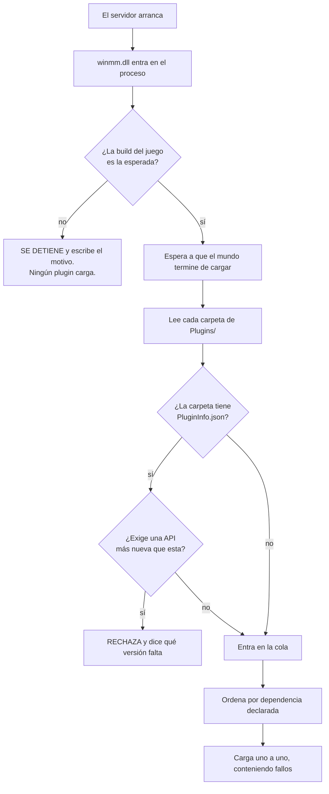

<p align="center">
  <a href="../README.md">&nbsp;Portugu&ecirc;s</a>
  &nbsp;&nbsp;&middot;&nbsp;&nbsp;
  <a href="README.en.md">&nbsp;English</a>
  &nbsp;&nbsp;&middot;&nbsp;&nbsp;
  <a href="README.es.md">&nbsp;<b>Espa&ntilde;ol</b></a>
</p>

# Conan-Api — plugins en tu servidor de Conan Exiles

El servidor dedicado de Conan Exiles no tiene sistema de plugins. No existe una
carpeta donde sueltas un archivo y ganas una función nueva. Si quieres un
`/kit`, un sistema de VIP o un teletransporte, la respuesta del juego es que eso
no existe.

Esta API lo resuelve. Copias dos cosas en la carpeta del servidor, y a partir de
ahí instalar un plugin es **arrastrar una carpeta**.

```
Conan-Api/
   Plugins/
      Permission/            <- ya viene, controla VIP y permisos
      PluginQueDescargaste/  <- arrastraste esta carpeta aquí
```

Nada más. No hay archivo de configuración que editar, no hay lista que rellenar,
no hay comando que ejecutar. Que la carpeta esté ahí es la instalación.

---

## Antes de todo: esto se ejecuta dentro de tu servidor

Un plugin es una DLL que se ejecuta **dentro del proceso del servidor**, con los
mismos poderes que él. Eso no es una limitación de esta API — es lo que
significa "plugin nativo" en cualquier juego. Pero tiene que quedar dicho antes
de que instales nada, y en letra grande:

**Un plugin instalado puede** leer y modificar cualquier cosa en la memoria del
servidor, leer los datos de identidad de tus jugadores, escribir cualquier
archivo que el servidor alcance, abrir conexión de red, y tumbar el servidor.

**La API contiene** el fallo de un plugin al cargar (el servidor arranca sin él),
una excepción dentro de un hook en la mayoría de los casos, y un conflicto entre
dos plugins. **La API no contiene** un plugin malicioso: no hay sandbox, y no la
va a haber.

Trata un plugin como tratarías cualquier programa que instalas en tu servidor:
de alguien en quien confías, preferiblemente con el código a la vista.

---

## Instalar — cinco minutos

Descarga el paquete en [Releases](../../../releases). Vas a tener dos cosas:

```
winmm.dll      el cargador. Sin él, no pasa nada.
Conan-Api/     la carpeta con todo dentro
```

**1.** Detén el servidor.

**2.** Ve a la carpeta del ejecutable:
`<servidor>\ConanSandbox\Binaries\Win64\`

**3.** Renombra la `winmm.dll` **que ya está ahí** (la de Windows) a
`winmm_orig.dll`.

> Si ya existe un `winmm_orig.dll` ahí, **detente**: ya instalaste antes.
> Renombrar de nuevo hace que el cargador apunte a sí mismo, y el servidor muere
> en silencio — sin registro, sin error, simplemente no arranca. Borra la
> `winmm.dll` nueva y empieza otra vez desde este paso.

**4.** Copia la `winmm.dll` (la nuestra) y la carpeta `Conan-Api` a esa misma
carpeta.

**5.** Levanta el servidor y abre `Conan-Api\Logs\ConanLoader.log`. Debe verse
así:

```
== ConanLoader iniciado ==
[winmm] encaminhadores prontos: 189 apontam para a winmm_orig, 0 ficaram ausentes.
reflexao estavel: 1508584 objetos vivos (nao cresceu alem de ~2% por 120 s).
1 pasta(s) de plugin encontrada(s).
  [ok] Permission  "Permissões"  v1.0.0  api>=2
       Permissões, grupos e VIP. Outros plugins consultam por ConanPermission.h.
== 1 plugin(s) carregado(s), 0 com falha ==
```

El cargador escribe ese registro en portugués, tal cual aparece arriba — la
línea que importa es la última, `1 plugin(s) carregado(s), 0 com falha`: un
plugin cargado, ninguno con fallo. Si ese archivo no llega a crearse, el
cargador no entró — revisa el paso 3.

---

## Cómo el cargador elige qué levantar



**Espera a que el mundo cargue a propósito.** Un plugin que busca jugadores
antes de eso encuentra un mundo a medias y concluye algo equivocado. Ya pasó
aquí: un plugin arrancó demasiado pronto y dejó el servidor clavado en 4,3 GB en
vez de los 8,7 normales.

---

## Instalar, desinstalar, apagar

| lo que quieres | lo que haces |
|---|---|
| instalar un plugin | arrastras su carpeta a `Conan-Api/Plugins/` |
| desinstalar | borras la carpeta |
| apagarlo sin perder la configuración | creas un archivo vacío llamado `DESLIGADO` dentro de su carpeta — ese es el nombre literal que el cargador busca, "apagado" en portugués, en mayúsculas y sin extensión |
| averiguar qué pasó | abres `Conan-Api/Logs/ConanLoader.log` |

Si una carpeta tiene más de una `.dll`, el cargador usa la que lleva el nombre
de la carpeta. Si hay dos y ninguna lleva el nombre correcto, **rechaza y dice
cuál renombrar** — elegir "la primera" cambiaría según el orden en que al
sistema de archivos le diera por listarlas, y algún día cargaría la equivocada
sin que nadie lo viera.

---

## El Permission — VIP y permisos

Viene incluido y es el plugin que los demás consultan. Guarda quién tiene qué en
una base de datos local, dentro de su propia carpeta:

```
Conan-Api/Plugins/Permission/
   ConanPermission.dll
   config.json          <- los nombres de los grupos, y la base (ver abajo)
   permission.db        <- nace solo en la primera ejecución
```

**Si no tocas nada**, usa esa base local y funciona. Si quieres un MySQL — porque
tienes varios servidores y quieres el VIP compartido entre ellos — es una línea
en el `config.json`.

---

## Cuando Conan se actualice

La API se va a **negar a cargar**, a propósito, y lo va a decir en el registro.

Eso no es un defecto. Conoce el juego por direcciones de memoria de esta versión
concreta; cuando Funcom actualiza, esas direcciones cambian de sitio. Una API que
siguiera trabajando estaría leyendo memoria aleatoria y entregando números
plausibles y falsos — tu VIP desaparecería, los permisos se invertirían, y nadie
ligaría el problema con la actualización del juego.

Prefiere el servidor que no arranca con plugins al servidor que arranca
mintiendo. Cuando eso pase, espera aquí una versión actualizada.

---

## Problemas comunes

**"Instalé y ningún plugin funciona"** — abre `Conan-Api\Logs\ConanLoader.log`.
Si el archivo no existe, el cargador no entró: la `winmm.dll` no está al lado
del ejecutable, o se te olvidó renombrar la original.

**"El servidor no arranca y no dice nada"** — casi siempre es un `winmm_orig.dll`
apuntando a sí mismo (una instalación encima de otra). Mira el paso 3.

**"Un plugin concreto no carga"** — el registro dice el motivo, con el nombre de
la carpeta. Puede ser una DLL que falta, un `PluginInfo.json` que exige una API
más nueva, o el archivo `DESLIGADO` olvidado ahí dentro.

---


## Escribir tus propios plugins

Es otro repositorio: **[Conan-Api-SDK](../../../../Conan-Api-SDK)**. Ahí están el
header, seis ejemplos con código fuente y la guía de compilación. Están separados
porque quien administra un servidor no necesita compilador para nada, y quien
escribe plugins no necesita los binarios del servidor.

---

## Créditos y licencia

*Conan Exiles* es de **Funcom**. Las imágenes de este repositorio son material de
divulgación oficial, de Steam. Este proyecto no tiene vínculo con Funcom ni con
Inflexion Games.

Esta API es trabajo independiente, hecho por ingeniería inversa del servidor
dedicado, sin SDK oficial y sin símbolos de depuración.

<p align="center">
  <a href="../README.md">&nbsp;Portugu&ecirc;s</a>
  &nbsp;&nbsp;&middot;&nbsp;&nbsp;
  <a href="README.en.md">&nbsp;English</a>
  &nbsp;&nbsp;&middot;&nbsp;&nbsp;
  <a href="README.es.md">&nbsp;<b>Espa&ntilde;ol</b></a>
</p>
